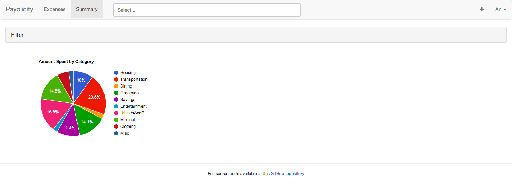

# payplicity-app

GitHub repo: https://github.ccs.neu.edu/NEU-CS5610-SU21/payplicity-app

Heroku link: https://payplicity-ui.herokuapp.com/

## Iteration 3: 

Everything were fully functional (finally!). CRUD work as expected with enhanced features that only allows modification when user's signed in. This week's work focused heavily on UI design and redirect/ route user to specific page. 

+ Home page:

+ Listing page:

+ Summary page:

### Group work:

Phong:
+ Fix bugs for CRUD operations.

An:
+ Deal with UI/ CSS.

Evgenii:
+ Deal with cookies issue/ login.

## Iteration 2: 

For iteration 2, API capable of executing GET and POST methods are when a functionality is called (Search, Edit, Delete, Summary, whole list displaying) due to a more detailed, extensible GraphQL query's and appropriate CRUD calls. We decided to drop the Grouping functionality due to the time-constraint.

+ Filter:

+ Spending summary:

+ Heroku link will send user directly to a Home page with a Welcome message - user won't be granted access to any other page unless signed in:

### Group work:

Phong: 
+ Maintain the majority of CRUD controller (List, Summary, Edit, Table, Detail), ensure functionality for each operation.
+ Edit querys for all type of mutations - add new components.
+ Add proper async/ await functions to keep track of whether the user is signed in and pass that as the parameter to components' state - adjust NavBar and AddNavItem.
+ Manage flow control.
+ Fix rendering bugs, reroute properly, ensure smooth transition between pages and data to accurately fetched.

An:
+ Add new data generator, add/ delete unnecessary field in schema.
+ Construct new api handler with according to new CRUD operation.
+ Fix branching and merging issue on flow control.
+ Create new DB database storing user's expense list and data, and new Atlas for this specific project, avoid conflict with the old one.
+ Redirect on signing in and out.

Evgenii:
+ Establish new components for user to sign without using Goolge OAuth.
+ Set up new collection for user's registration and authenticate user's sign in information based on existing database.
+ Export necessary user's information/ cookies after sign in to fetch/ load data for that user.
+ Fix rerouting issues, run test on connecting between components when new component is added.
+ Reorganize UI (buttons, components placements) when UX changes.

## Iteration 1:
For iteration 1, we change the UI component for adding expenses and create the graphQL schema along with the mongoDB_init.js

Screenshot of the UI component when adding a new expense

Work:
Phong:
+ Setup UI component for adding a new expense
+ Minimal work changing the report->summary page and the about page

An:
+ Design new GraphQL schema and mongoDB.init.js

Evgenii:
+ Troubleshoot server side